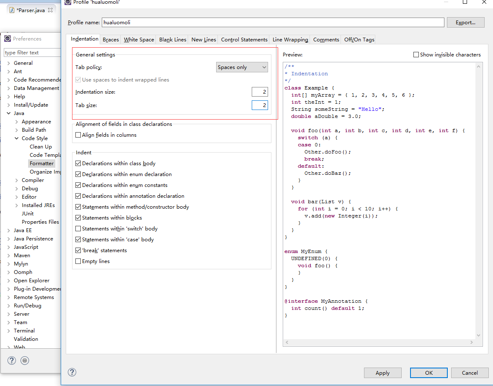

# 配置eclipse

## 配置编码
修改eclipse.ini增加
```
-Dfile.encoding=UTF-8
```
 <br/>

## 代码模板
### Comments - Types
```
/**
 * @author ${user}
 */
```
<br/>


## 代码格式化
<br/>

<br/>

## 空格代替tab
 </br>

 </br>

 </br>
